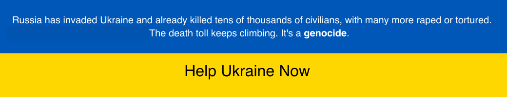

# Standing with Ukraine

	
	
 
 
 
 
 
 

# Useful Resources

## Information / Cyber Security Companies
-  [`AegIS Cyber Security`](https://www.aegis-cs.eu)
-  [`PHI Consultancy`](https://www.phiconsultancy.eu)
-  [`Information Security on Demand`](https://www.informationsecurityondemand.eu) 

## Information Security Bloggers
-  [`Panagiotis Kalantzis Blog`](https://www.kalantzis.me/blog)

## Information Security News

## Information Security Bulletins
- [`Amazon Web Services (AwS) Security Bulletins`](https://aws.amazon.com/security/security-bulletins)
- [`Google Cloud Platform (GPC) Security Bulletins`](https://cloud.google.com/support/bulletins)
- [`Microsof Azure Security Bulletins`](https://msrc-blog.microsoft.com/2022/08/09/security-update-guide-notification-system-news-create-your-profile-now/​) (You need to setup a profile w/ Microsoft's Security Response Center)

