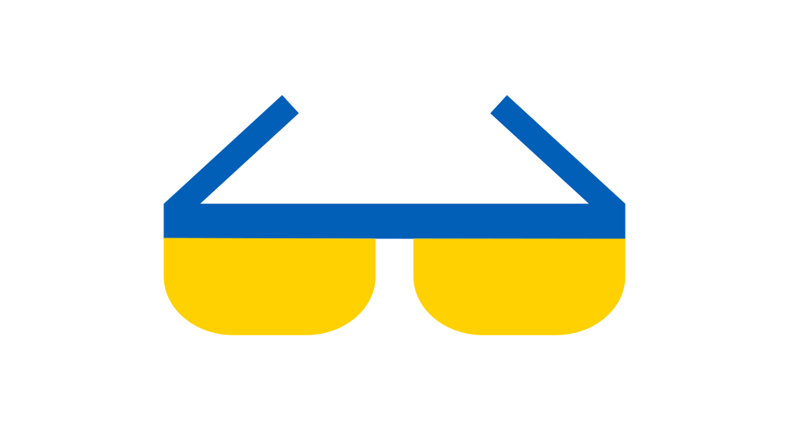
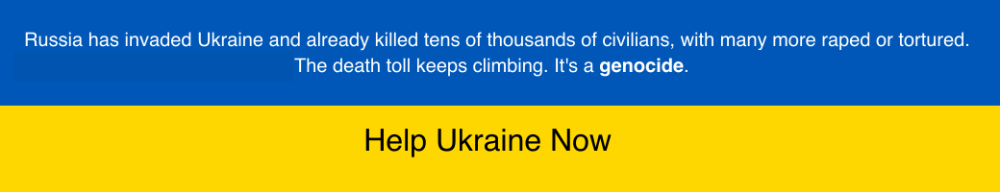

# Standing with Ukraine

	
	
 
 
 

# Useful Resources

> A curated list of Information / Cyber Security, Privacy and other resources.

This list aims to provide a starting point to information/cyber security professionals, and anyone with interest in these fields  to dive into and gain the required insights for personal development.

<!-- I try my best to maintain this repository and keep it up-to-date but if you spot a broken link or a resource which isn't listed, please, feel free to make a pull request. -->

## Information / Cyber Security Companies
- [`AegIS Cyber Security`](https://www.aegis-cs.eu)  
<!-- - [`PHI Consultancy`](https://www.phiconsultancy.eu)   -->
<!-- - [`Information Security on Demand`](https://www.informationsecurityondemand.eu)   -->
- [`Netscan`](https://netscan.gr) 

## Information Security Bloggers
- [`Panagiotis Kalantzis Blog`](https://www.kalantzis.me/blog)   
- [`Krebs on Security`](http://krebsonsecurity.com)
- [`Schneier on Security`](https://www.schneier.com/)
- [`TaoSecurity`](https://www.taosecurity.com)

## Information Security Magazines
- [`IT Security Professionnal`](https://www.itsecuritypro.gr/) 
- [`Cyber Defense Magazine`](https://www.cyberdefensemagazine.com)

## Information Security & Privacy Conferences
- [`Infosecurity Europe`](https://www.infosecurityeurope.com/)
- [`Blackhat`](https://www.blackhat.com)
- [`Infocom Security`](https://www.infocomsecurity.gr/)
- [`Information Security Conference`](https://www.eits.gr/)
- [`Data Privacy & Protecton Conference`](https://www.dataprivacy.gr/)
- [`Infocom Security Cyprus`](https://infocomsecurity.com.cy)

## Information Security & Privacy News
- [`Help Net Security`](https://www.helpnetsecurity.com)
- [`The Register`](https://www.theregister.com/security)
- [`SC Magazine`](http://www.scmagazine.com)
- [`The Hacker News`](https://thehackernews.com)
- [`Dark Reading`](http://www.darkreading.com)
- [`CSO Online`](http://www.csoonline.com)
- [`Threatpost`](https://threatpost.com)
- [`SecurityWeek`](https://www.securityweek.com)
- [`CPO Magazine`](https://www.cpomagazine.com)

## Information Security & Privacy Books
### Wiley
- [`Start-Up Secure: Baking Cybersecurity into Your Company from Founding to Exit (1st Edition)`](https://www.amazon.com/Start-Up-Secure-Cybersecurity-Company-Founding/dp/1119700736)
- [`The CISO Evolution: Business Knowledge for Cybersecurity Executives (1st Edition)`](https://www.amazon.com/CISO-Evolution-Knowledge-Cybersecurity-Executives/dp/1119782481)
- [`The Security Culture Playbook: An Executive Guide To Reducing Risk and Developing Your Human Defense Layer (1st Edition)`](https://www.amazon.com/Security-Culture-Playbook-Executive-Developing/dp/1119875234)

## Cyber Security & Privacy International Organizations
- [`International Organization for Standardization (ISO)`](https://www.iso.org)
- [`European Union Agency for Cybersecurity (ENISA)`](https://www.enisa.europa.eu)
- [`European Data Protection Board (EDPD)`](https://edpb.europa.eu/edpb_en)
- [`European Data Protection Supervisor (EDPS)`](https://edps.europa.eu/_en)
- [`Cloud Security Alliance (CSA)`](https://cloudsecurityalliance.org/)
- [`Payment Card Industry (PCI) Security Standards Council`](https://www.pcisecuritystandards.org/)
- [`SysAdmin, Audit, Network, and Security (SANS) Institute`](https://www.sans.org)
- [`Cybersecurity and Infrastructure Security Agency (CISA)`](https://www.cisa.gov)
- [`National Institute of Standards and Technology (NIST) Computer Security Resource Center (CSRC)`](https://csrc.nist.gov/)
 
## Cyber Security & Privacy International Professional Membership Organizations
- [`International Information System Security Certification Consortium (ISC2)`](https://www.isc2.org)
- [`Information Systems Audit and Control Association (ISACA)`](https://www.isaca.org)
- [`International Association of Privacy Professionals (IAPP)`](https://iapp.org)
- [`Open Compliance and Ethics Group (OSEG)`](https://www.oceg.org)

## Information Security & Privacy International Standards
### International Organization for Standardization (ISO)
- [`ISO/IEC 27000:2018 - Information technology — Security techniques — Information security management systems — Overview and vocabulary`](https://www.iso.org/standard/73906.html)
- [`ISO/IEC 27001:2022 - Information security, cybersecurity and privacy protection — Information security management systems — Requirements`](https://www.iso.org/standard/82875.html)
- [`ISO/IEC 27002:2022 - Information security, cybersecurity and privacy protection — Information security controls`](https://www.iso.org/standard/75652.html)
- [`ISO/IEC 27005:2022 - Information security, cybersecurity and privacy protection — Guidance on managing information security risks`](https://www.iso.org/standard/80585.html)
- [`ISO/IEC 27017:2017 - Information technology — Security techniques — Code of practice for information security controls based on ISO/IEC 27002 for cloud services`](https://www.iso.org/standard/43757.html)
- [`ISO/IEC 27018:2019 - Information technology — Security techniques — Code of practice for protection of personally identifiable information (PII) in public clouds acting as PII processors`](https://www.iso.org/standard/76559.html)
- [`ISO/IEC 27701:2019 - Security techniques — Extension to ISO/IEC 27001 and ISO/IEC 27002 for privacy information management — Requirements and guidelines`](https://www.iso.org/standard/71670.html)
- [`ISO 22301:2019 - Security and resilience — Business continuity management systems — Requirements`](https://www.iso.org/standard/75106.html)
- [`ISO 31000:2018 - Risk management — Guidelines`](https://www.iso.org/standard/65694.html)
### National Institute of Standards and Technology (NIST) 
- [`NIST Sspecial Publicaation (SP) 800-37 Rev.2 - Risk Management Framework for Information Systems and Organizations: A System Life Cycle Approach for Security and Privacy`](https://csrc.nist.gov/publications/detail/sp/800-37/rev-2/final)
- [`NIST Sspecial Publicaation (SP) 800-39 - Managing Information Security Risk: Organization, Mission, and Information System View`](https://csrc.nist.gov/publications/detail/sp/800-39/final)
- [`NIST Sspecial Publicaation (SP) 800-53 Rev.5 - Security and Privacy Controls for Information Systems and Organizations`](https://csrc.nist.gov/publications/detail/sp/800-53/rev-5/final)
- [`NIST Sspecial Publicaation (SP) 800-53A Rev.5 - Assessing Security and Privacy Controls in Information Systems and Organizations`](https://csrc.nist.gov/publications/detail/sp/800-53a/rev-5/final)
- [`NIST Sspecial Publicaation (SP) 800-53B - Control Baselines for Information Systems and Organizations`](https://csrc.nist.gov/publications/detail/sp/800-53b/final)
- [`NIST Sspecial Publicaation (SP) 800-171 Rev.2 - Protecting Controlled Unclassified Information in Nonfederal Systems and Organizations`](https://csrc.nist.gov/publications/detail/sp/800-171/rev-2/final)
### Other Interrnational Standards
- [`Payment Card Industry Data Security Standard (PCI-DSS)`](https://blog.pcisecuritystandards.org/pci-dss-v4-0-resource-hub)
- [`Cloud Security Alliance (CSA) Security, Trust, Assurance, and Risk (STAR)`](https://cloudsecurityalliance.org/star/)
- [`Statement on Standards for Attestation Engagements no. 18 (SSAE-18)`](https://us.aicpa.org/content/dam/aicpa/research/standards/auditattest/downloadabledocuments/ssae-no-18.pdf) 
- [`Federal Risk and Authorization Management Program (FedRAMP)`](https://www.fedramp.gov/)

## Information Security & Privacy Laws and Regulations
### Europe
- [`Regulation (EU) 2016/679 (General Data Protection Regulation - GDPR) of the European Parliament and of the Council of 27 April 2016 on the protection of natural persons with regard to the processing of personal data and on the free movement of such data, and repealing Directive 95/46/EC`](https://eur-lex.europa.eu/legal-content/EN/TXT/?uri=CELEX%3A32016R0679)
- [`Directive (EU) 2022/2555 (NIS 2 Directive)of the European Parliament and of the Council of 14 December 2022 on measures for a high common level of cybersecurity across the Union, amending Regulation (EU) No 910/2014 and Directive (EU) 2018/1972, and repealing Directive (EU) 2016/1148`](https://eur-lex.europa.eu/eli/dir/2022/2555/oj)
- [`Regulation (EU) 2022/2554 (Digital Operational Resilience Act - DORA) of the European Parliament and of the Council of 14 December 2022 on digital operational resilience for the financial sector and amending Regulations (EC) No 1060/2009, (EU) No 648/2012, (EU) No 600/2014, (EU) No 909/2014 and (EU) 2016/1011`](https://eur-lex.europa.eu/legal-content/en/TXT/?uri=CELEX:32022R2554)
### United States
- [`Federal Information Security Modernization Act (FISMA)`](https://www.govinfo.gov/content/pkg/PLAW-107publ347/pdf/PLAW-107publ347.pdf)
- [`Gramm-Leach-Bliley Act (GLBA)`](https://www.govinfo.gov/content/pkg/PLAW-106publ102/pdf/PLAW-106publ102.pdf)
- [`The Sarbanes-Oxley Act`](https://www.govinfo.gov/content/pkg/PLAW-107publ204/pdf/PLAW-107publ204.pdf)
- [`Federal Consumer Online Privacy Rights Act (COPRA)`](https://www.consumerprivacyact.com/wp-content/uploads/2019/12/Consumer-Online-Privacy-Rights-Act-COPRA-Bill-Text.pdf)
- [`California Consumer Privacy Act (CCPA) of 2018`](https://leginfo.legislature.ca.gov/faces/codes_displayText.xhtml?division=3.&part=4.&lawCode=CIV&title=1.81.5)
- [`California Privacy Rights Act (CPRA) of 2020`](https://vig.cdn.sos.ca.gov/2020/general/pdf/topl-prop24.pdf)
- [`Children’s Online Privacy Protection Rule (COPPA)`](https://www.ecfr.gov/current/title-16/chapter-I/subchapter-C/part-312)
- [`Connecticut Data Privacy Act (CTDPA)`](https://www.cga.ct.gov/2022/act/Pa/pdf/2022PA-00015-R00SB-00006-PA.PDF)
- [`Utah Consumer Provacy Act`](https://legiscan.com/UT/text/SB0227/id/2546519)
- [`Virginia Consumer Data Protection Act (VCDPA)`](https://law.lis.virginia.gov/vacodefull/title59.1/chapter53/)
- [`Health Insurance Portability and Accountability Act of 1996 (HIPAA)`](https://www.govinfo.gov/content/pkg/PLAW-104publ191/pdf/PLAW-104publ191.pdf)
### Rest of the world
- [`The Personal Information Protection and Electronic Documents Act (PIPEDA)`](https://www.priv.gc.ca/en/privacy-topics/privacy-laws-in-canada/the-personal-information-protection-and-electronic-documents-act-pipeda)
- [`Protection of Personal Information Act (POPIA)`](https://popia.co.za/)
- [`Privacy Act 1988`](https://www.legislation.gov.au/Details/C2014C00076)
- [`Personal Information Protection Law (PIPL)`](http://www.npc.gov.cn/npc/c30834/202108/a8c4e3672c74491a80b53a172bb753fe.shtml) - [`English Translation`](https://digichina.stanford.edu/work/translation-personal-information-protection-law-of-the-peoples-republic-of-china-effective-nov-1-2021/)
- [`Act on the Protection of Personal Information No. 57 of 2003 (“APPI”)`](https://www.cas.go.jp/jp/seisaku/hourei/data/APPI.pdf)

## Information Security Bulletins & Advisories
- [`Amazon Web Services (AwS) Security Bulletins`](https://aws.amazon.com/security/security-bulletins)
- [`Google Cloud Platform (GPC) Security Bulletins`](https://cloud.google.com/support/bulletins)
<!-- - [`Microsof Azure Security Bulletins`](​) -->
- [`CISCO Security Advisories`](https://sec.cloudapps.cisco.com/security/center/publicationListing.x)

## Cyber Security & Privacy Certifications
### International Information System Security Certification Consortium (ISC2)
- [`Certified in Cybersecurity (CC)`](https://www.isc2.org/Certifications/cc)
- [`Certified Information Systems Security Professional (CISSP)`](https://www.isc2.org/Certifications/CISSP)
- [`Certified Cloud Security Professional (CCSP)`](https://www.isc2.org/Certifications/CCSP) 
### Information Systems Audit and Control Association (ISACA)
- [`Certified Information Systems Auditor (CISA)`](https://www.isaca.org/credentialing/cisa)
- [`Certified Information Security Manager (CISM)`](https://www.isaca.org/credentialing/cism)
- [`Certified Data Privacy Solutions Engineer (CDPSE)`](https://www.isaca.org/credentialing/cdpse)
- [`Certified in Risk and Information Systems Control (CRISC)`](https://www.isaca.org/credentialing/crisc)
### International Association of Privacy Professionals (IAPP)
- [`Certified Information Privacy Professional (CIPP)`](https://iapp.org/certify/cipp)
- [`Certified Information Privacy Manager (CIPM)`](https://iapp.org/certify/cipm)
- [`Certified Information Privacy Technologist (CIPT)`](https://iapp.org/certify/cipt)
### Cloud Security Alliance (CSA)
- [`Certificate of Cloud Security Knowledge (CCSK)`](https://cloudsecurityalliance.org/education/ccsk)
- [`Certificate of Cloud Auditing Knowledge (CCAK)`](https://cloudsecurityalliance.org/education/ccak)
### Other Certifications
- [`AWS Certified Cloud Practitioner`](https://aws.amazon.com/certification/certified-cloud-practitioner)

## Cyber Security & Privacy Training
### Cybrary
- [`Certified Information Systems Security Professional (CISSP)`](https://app.cybrary.it/browse/course/cissp) 
- [`Certified Information Systems Auditor (CISA)`](https://app.cybrary.it/browse/course/cisa) 
- [`Certified Information Security Manager (CISM)`](https://app.cybrary.it/browse/course/cism) 
- [`Certified in Risk and Information Systems Control (CRISC)`](https://app.cybrary.it/browse/course/crisc) 
- [`Certified Cloud Security Professional (CCSP)`](https://app.cybrary.it/browse/course/ccsp) 
- [`Certificate of Cloud Security Knowledge (CCSK)`](https://app.cybrary.it/browse/course/ccsk) 
- [`Privacy Program Management`](https://app.cybrary.it/browse/course/privacy-program-management) 
- [`AWS Certified Cloud Practitioner`](https://app.cybrary.it/browse/course/aws-cloud-practitioner-2021-10-12) 

## Cyber Security & Privacy Programs and Tools
- [`Bitwarden Password Manager`](https://bitwarden.com)    
- [`Eramba Governance Risk & Compliance (GRC)`](https://www.eramba.org)    
- [`JumpCloud Open Directory`](https://jumpcloud.com)  
- [`Privacy Impact Assessment (PIA) | CNIL`](https://www.cnil.fr/en/privacy-impact-assessment-pia)  
- [`Simplerisk Governance Risk & Compliance (GRC)`](https://www.simplerisk.com)  

## Other Resources
- [`NSA Cybersecurity Directorate GitHub`](https://github.com/nsacyber)
- [`CISA Bad Practices Discussions GitHub`](https://github.com/cisagov/bad-practices/discussions)

## How to Share
- [Share on Facebook](https://www.facebook.com/sharer/sharer.php?s=100&p[url]=https://github.com/pkalantzis/useful-resources&p[images][0]=&p[title]=Useful%20Resources&p[summary]=)
- [Share on LinkedIn](https://www.linkedin.com/shareArticle?mini=true&url=https://github.com/pkalantzis/useful-resources&title=Useful%20Resources&summary=&source=)

## License
